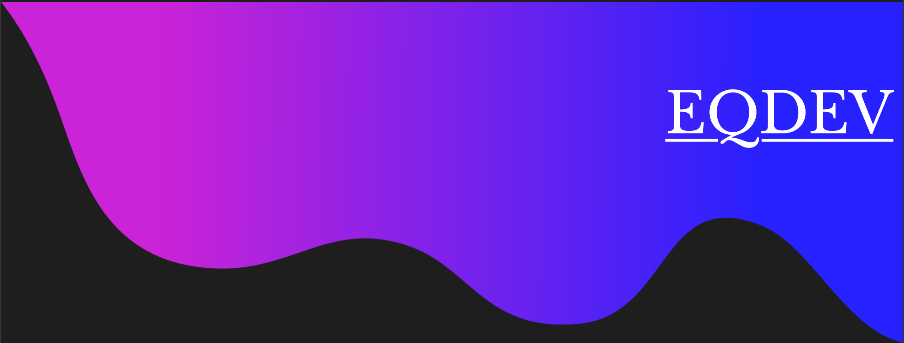

<!--  -->
## Hi there 👋, I'm Zeke!

Current MSCS Student at Georgia Tech (🐝) studying high performance computing and machine learning.

- 🌱 I’m currently learning **NextJS** / **Tailwind CSS** / **NodeJS**
- 👯 I’m looking to collaborate on open source projects
- 🤔 I’m looking for help with modern front-end development
- 💬 Ask me about my hobbies! (🎮, 🛹, 🎸, 🥁)

### 💻 My Technologies
&nbsp;
&nbsp;
&nbsp;
&nbsp;
&nbsp;\

&nbsp;
&nbsp;
&nbsp;\
&nbsp;
&nbsp;
&nbsp;
&nbsp;\
&nbsp;
&nbsp;
&nbsp;
&nbsp;

### 🙌 More Info
&nbsp;
&nbsp;
